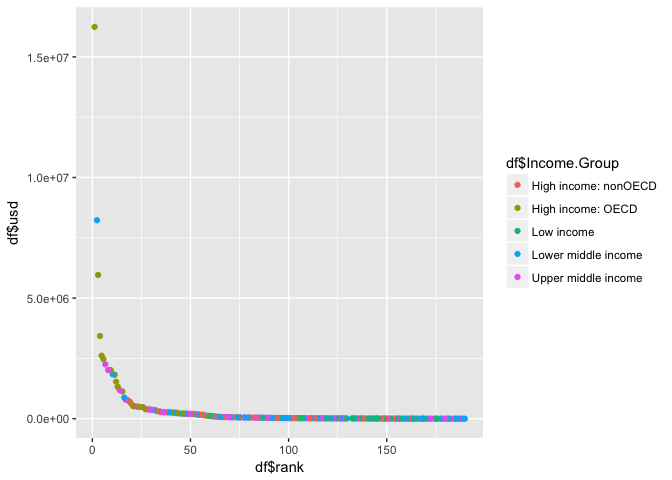

# CaseStudy1
Cory Nichols  
2/28/2017  


####Introduction
We are investigating GDP quantities by country. 


#
####Data Cleaning and Setup

To clean the dataset, we'll rename the columns of the gdp dataset and transform gdp quantities to numeric

We will also join the gdp and education datasets on the code variable


```
## [1] 189
```

####Ordering GDP

In order to determine the 13th lowest GDP country in the dataset, we arrange and index the now-joined dataset:


```
##             Short.Name
## 13 St. Kitts and Nevis
```


####Mean GDP Ranking by Category

We are specifically interested in determining the mean GDP rank position for High Income groupings. In order to investigate this datapoint, we transform rank


```
##           Income.Group   avgRank
## 1 High income: nonOECD  91.91304
## 2    High income: OECD  32.96667
## 3           Low income 133.72973
## 4  Lower middle income 107.70370
## 5  Upper middle income  92.13333
```

####Plotting GDP

Plot GDP positions

<!-- -->

####Lower Middle Income in Quantile 1

Detail here

```
## [1] 5
```

####Conclusion

This is the conclusion
